# 在vscode中配置git

## 安装

## 配置git

### 1.设置全局变量

```
git config --global user.name "your name" 
git config --global user.email "your@email.com"
```

### 2.登陆github,创建SSHKey

> ssh-keygen -t rsa -C "your@email.com"

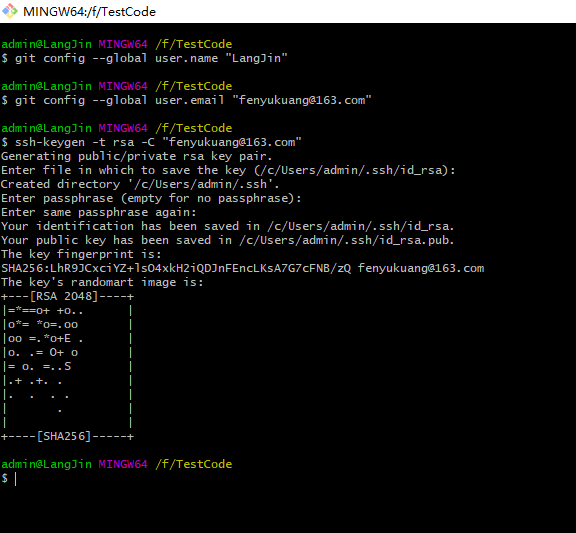

会在本地用户文件夹下生成.ssh的文件夹，里面包含id_rsa和id_rsa.pub两个文件

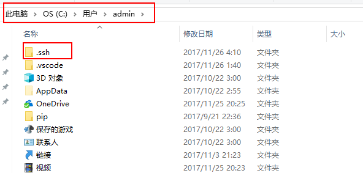

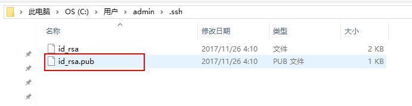

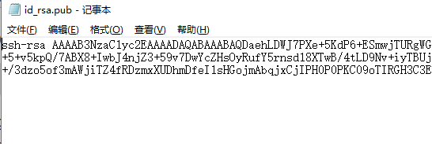

然后我们回到刚刚注册的GitHub账号里去，点击设置

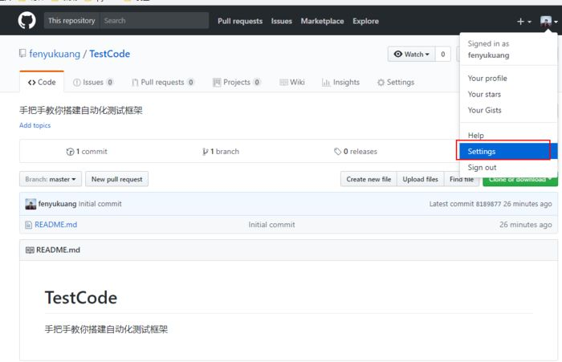

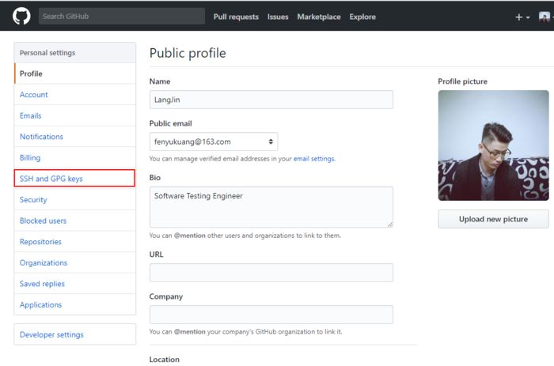

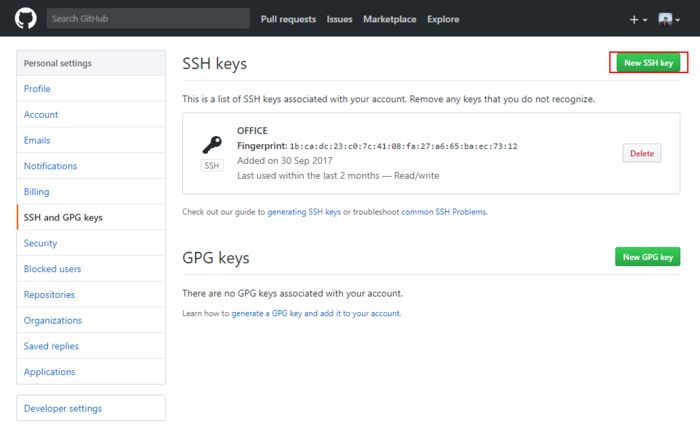

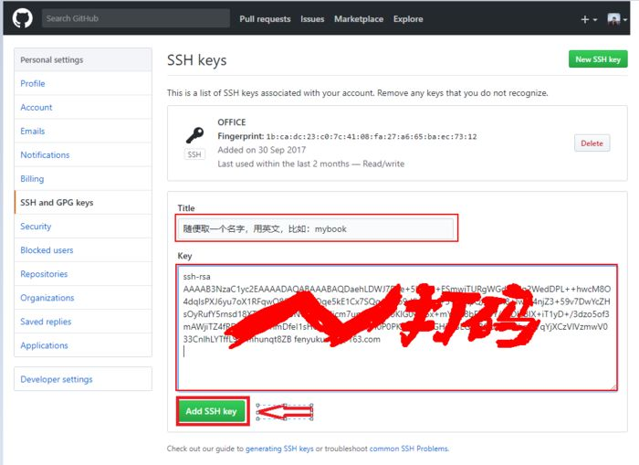

然后回到git，输入

`ssh -T git@github.com`

最后，输入yes!

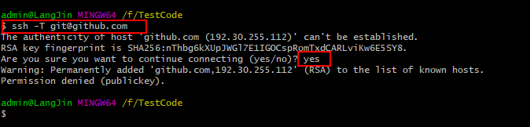

### 3.克隆仓库

复制GitHub上的仓库地址

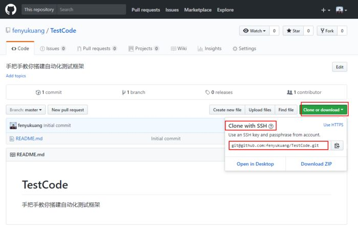

在Git上输入这个，克隆仓库到本地

```text
git clone git@github.com:fenyukuang/TestCode.git
```


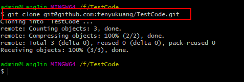

然后把我们一遍文章中生成的VScode的配置文件复制过去。
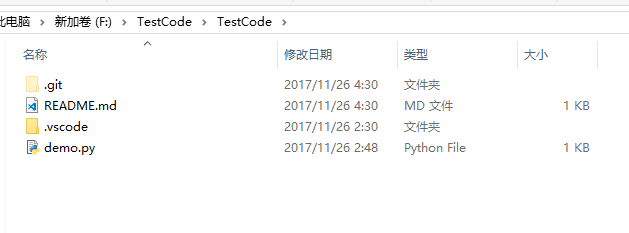
